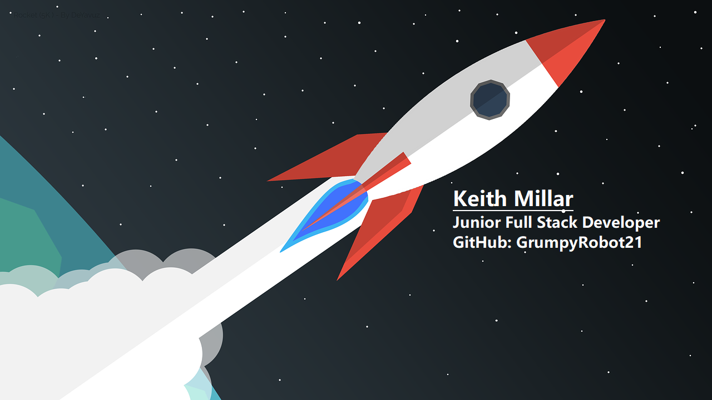

***

# **Keith Millar**
## **Junior Full Stack Software Developer**
***

Hi, I’m Keith, I’m learning to code in order to facilitate a career change into software developement. I am currently completing the Full Stack Developer Diploma with Code Institute. I’m looking to collaborate on anything and everything where I am able to ask questions and learn how to be a better dev.

I am proficient in: 

I am in the process of acquiring knowledge in:

I also have over 25 years of complimentary experience in board level relationship management and communication (UK & Europe), Strategic planning and business development, Internet technologies, Internet hosting and security, IT training, development and education plus customer service and support. 

You can reach me here: 

***
## **Code Institute Milestone Projects**

As part of my Code Institute Diploma I have created the following projects. These were challenging but gave me a great way to use the coding skills introduced throughout studies:

1. 

| Milestone No.   | Project | Description | Grade | 
| :-----------: | :-----------: | :-----------: | :-----------: |
| 1 | 

[WebLife Digital Legacy Management](https://grumpyrobot21.github.io/WebLife---Portfolio-Project-1---HTML-CSS-Essentials/)
 | 
This web application has been developed in order to stimulate discussion around the topic of what happens to our online data after we are no longer around to look after it. The website represents a fictional consultancy that offers to manage clients digital legacies prior to and in the event of their deaths. Using HTML and CSS| Merit |
| 2 | 

[Rock Paper Scissors Lizard Spock](https://grumpyrobot21.github.io/Rock-Paper-Scissors-Lizard-Spock---Portfolio-Project-2---JavaScript-Essentials/)
 | 
This application presents an interactive and fun version of the game 'Rock Paper Scissors Lizard Spock' as represented in the popular TV series 'The Big Bang Theory' using HTML, CSS and JavaScript | Merit |

***
## **Code Institute Hackathons**

I have participated in the following code institute hackathons. These were a fabulous learning experience and really good fun. It was great to be able to collaborate with other developers as part of a team to produce a project within a set deadline. It has also been a great introduction to the use of the Agile methodology, pull requests and merge conflicts.

- July 2022 Hackathon World Emoji Day

| Date, Theme & Organiser   | Hackathon Project | Place |
| :--------: | :-----------: | :--------------: |
| 
June 2022:

World Emoji Day 2022 Hackathon.

Code Institute
 | 

CatchMoji!
|  |

- September 2022 Hackathon Time to Close the Gender Gap

| Date, Theme & Organiser   | Hackathon Project | Place |
| :--------: | :-----------: | :--------------: |
| 
Sept 2022:

Time to Close the Gender Gap Hackathon.

Code Institute
 | 

My Code Journey
|  | 

***

